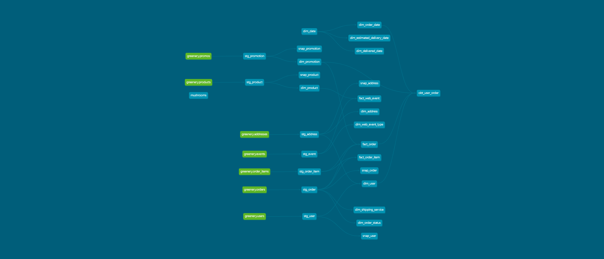

(Part 1) Models
We were approached by the marketing team to answer some questions about Greenery’s users! Use your staging models you created in Week 1 to answer their questions:

What is our user repeat rate?

Repeat Rate = Users who purchased 2 or more times / users who purchased

SELECT COUNT(user_guid) FROM ( SELECT user_guid,COUNT(order_guid) FROM "stg_order" GROUP BY user_guid HAVING COUNT(order_guid) > 1) repeat_user

103

SELECT COUNT(DISTINCT user_guid) count FROM "stg_order"

128

= 80%

What are good indicators of a user who will likely purchase again?

- multiple orders
- recent orders
- orders delivered on time
- orders even if no promotions

What about indicators of users who are likely NOT to purchase again?
- few website visits
- no recent website activity
- orders delivered late

If you had more data, what features would you want to look into to answer this question?

NOTE: This is a hypothetical question vs. something we can analyze in our Greenery data set. Think about what exploratory analysis you would do to approach this question.

More stakeholders are coming to us for data, which is great! But we need to get some more models created before we can help. Create a marts folder, so we can organize our models, with the following subfolders for business units:

Core
Marketing
Product

Within each marts folder, create at least 1-2 intermediate models and 1-2 dimension/fact models.

Note: think about what metrics might be particularly useful for these business units, and build dbt models using greenery’s data
For example, some “core” datasets could include fact_orders, dim_products, and dim_users
The marketing mart could contain a model like “user_order_facts” which contains order information at the user level
The product mart could contain a model like “fact_page_views” which contains all page view events from greenery’s events data

Explain the marts models you added. Why did you organize the models in the way you did?

- created core (dimensions), inventory, marketing, sales, shipping and website folders.Could also include finance.

The core folder contains the common dimensions. The other folders are per business unit. Where analysis specific to that business unit is presented.

- not sure what the intermediate files are for? prefer to have dimensions and facts exposed to users, intermediate are building blocks. 

- have facts at the lowest grain, and build analysis facts/one big table/aggregates over those.

Use the dbt docs to visualize your model DAGs to ensure the model layers make sense

Paste in an image of your DAG from the docs

DAG:

(Part 2) Tests
We added some more models and transformed some data! Now we need to make sure they’re accurately reflecting the data. Add dbt tests into your dbt project on your existing models from Week 1, and new models from the section above

What assumptions are you making about each model? (i.e. why are you adding each test?)

- added a bunch of tests: unique, not_null, accepted_values, relationships, postive_value
- if more time would add calculation checks on multi-columns
- added tests to dim and fact tables as well as staging tables.

Did you find any “bad” data as you added and ran tests on your models? How did you go about either cleaning the data in the dbt model or adjusting your assumptions/tests?

- for some I have special rows, 0 - Not Applicable etc
- for others I removed the tests.
- there were some data quality issues with the dollar amounts in the orders. Would be good to have unit price in the order items, line extension.

Apply these changes to your github repo

Your stakeholders at Greenery want to understand the state of the data each day. Explain how you would ensure these tests are passing regularly and how you would alert stakeholders about bad data getting through.

- One way would be to have a data quality dimension on the fact tables
- Also a dashboard with data quality issues, and or a report emailed to the stakeholder explaining the issues and the trend.
